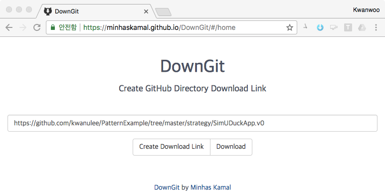

#Design Patterns Code Examples

이 저장소에 나온 Code는 [Head First Design Patterns](http://shop.oreilly.com/product/9780596007126.do) 책의 예제를 [IntelliJ IDEA IDE](https://www.jetbrains.com/idea/) 프로젝트 형식으로 만든 것입니다.

각 패턴의 예제 프로젝트를 개별적으로 다운 받기 위해서는 [https://minhaskamal.github.io/DownGit/#/home](https://minhaskamal.github.io/DownGit/#/home) 사이트를 접속하여 다운 받기 위한 **Github 서브 디렉토리의 URL**을 입력하여 다운 받을 수 있습니다.

가령, **strategy 패턴의 SimUDuckApp.v0** 프로젝트를 다운 받으려면, 해당 프로젝트의 URL인 **https://github.com/kwanulee/PatternExample/tree/master/strategy/SimUDuckApp.v0** 을 아래 그림처럼 입력창에 입력후 **Download**를 클릭하여 다운 받을 수 있습니다.

 